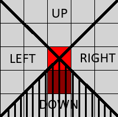
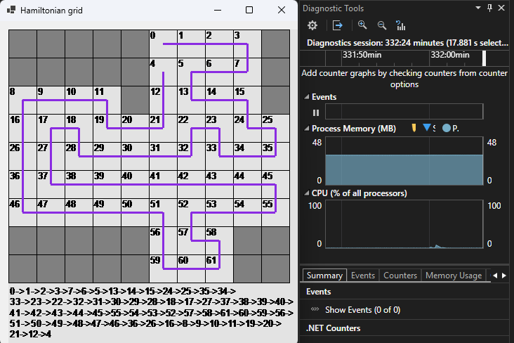

# GS2 

# Požadavky

- Nainstalovanou **SQL Server Express LocalDB** (V expresní instalaci je instalována automaticky)
- Požadování dodatečně nainstalovat NuGet Microsoft.Data.SqlClient;
 viz [Link](https://www.nuget.org/packages/Microsoft.Data.SqlClient/6.0.2?_src=template)


# Popis

**Popis funkcí**

Hra had. Obsahuje následující prvky:
- Ovládání klávesnicí (tlačítka **AWSD**), pomocí Myši nebo obě možnosti (bere relativní pozici hlavy hada, která je průnikem uhlopříček podle které se rozhodne pohyb (zpáteční směr je zakázaný)). viz. obrázek:



Při ovládání přes myš bere poslední pozici myši při pohybu na herní ploše a podle ní nastavuje směr).
Pomocí tlačítka nebo tlačítka 'p' lze hru pozastavit

Sekce s nastavením "Options", která umožňuje nastavení:

    - Nastavení velikosti bloků
    - Nastavení množství řádků a sloupců herní plochy
    - Nastavení ovládání přes myš, klávesnici nebo obojí
    - Množství jídla na herní ploše
    - Počáteční rychlost
    - Množství jídla
    - Množství jídla potřebné na zvýšení obtížnosti
    - Procentuální navýšení rychlosti při zvýšení obtížnosti

V sekci nastavení je "Nastav zdi" tlačítko, které umožňuje nastavit, kde budou generované zdi. Nastavení bloků zdí lze pomocí kliknutí myší na daný blok pro změnu jednoho bloku, nebo kliknutím a táhnutím pro změnu ve více blocích. 
Pokud se v hlavním nastavovacím formuláři neuloží nastavení (pomocí tlačítka "Ulož") tak i nastavení v "Nastav Zdi" nebude uloženo.

Přidání Hamiltoninaského cyklu přes tlačítko "Hamiltonian". Pomocí tohoto algoritmu vytvoří a zobrazí cestu nad aktuální mřížkou, která zobrazí cestu která projde přes každý blok, který není zeď právě jednou a vrátí se na původní místo. Složitost algoritmu je O(n!) a pokud se bude spouštět na mřížce která má více bloků než je 50 tak výpočet může trvat hodiny. viz.: (obsahuje 62 uzlů a okolo 210 spojů)



Hra také umožňuje po ukončení hry (prohrou) uložit do lokální MS SQL databáze uložit záznam hry, který může být pomocí tlačítka "Load Replay" a následného stlačení tlačítka "Start" přehrán od začátku do konce.

Při stlačení tlačítka "Restart" je simulace/hra zrušena a nachystána nová hra(pozastavená).

### O projektu
Hlavní účel projektu pro mě byl vyzkoušet si některé postupy řešení, kde původní "plán" byl vytvořit základní hru had s rozsáhlou možností nastavení (viz. sekce Options ve hře). Následně mě napadlo postupně přidávat do projektu další funkce a testovat jak pružný kód pro provádění změn vůbec je. V některých případech jsem chtěl použít více řešení, pro některé problémy než jeden, který by stačil(například využití JSON a SQL databáze je z mého pohledu v projektu nadbytečné a stačilo by využití jen json/SQL). Zatím projekt považuji za neukončený a občas některé části upravuji nebo přidávám další funkce (viz. například sekce TODO na konci). 

### Třída Settings

Hlavní nastavovací prvky.
Veškerá 'globální nastavení' jsou uložena v třídě Settings, která je při změnách uložena do JSON souboru jako výchozí nastavení pro příští zapnutí.

Modifikovatelné v OptionsForm (formulář pro nastavení):
```
JsonSaveFileName
UseMousePositionToMove 
UseKeyboardToMove 
FoodCount 
LevelIncreaseInterval
TickInMilliseconds
DifficultyIncrease
CellSize
Rows
Columns
WallPositions
```
Tyto proměnné se mění v průběhu hry:
```
Level
FoodsEaten
Moves
HeadPosition
GameOver
ForbiddenDirection
SnakeStartingHeadPosition
Pause
CurrentSpeed
```

### Poznámky

Zpracováno v `MSV 17.13.5` `.NET Framework 4.8.09032`

Využití JSON a databáze je podle mě logicky nesmyslné, ale chtěl jsem použít oba způsoby pro procvičení.
WFA pro tento projekt není nejlepší hlavně kvůli vykreslování, které při překreslování způsobuje blikání. To se objevuje i přes to, že bylo výrazně zmírněno skrze regionální vykreslování jen v oblastech kde je tomu potřeba.

V projektu byl použit algoritmus pro výpočet Hamiltonianského cyklu ze stránky [geeksforgeeks.org](https://www.geeksforgeeks.org/hamiltonian-cycle/).

### TODO

- ~~Aplikace "Hamiltonian cycle" pro Automatizaci hry.~~
- Přidat možnost automatizace hry, kde pohyb hada bude řízena Hamiltoniánským cyklem(pravděpodobně vytvořit novou třídu která bude dědit z Grid).
  - Optimalizovat hledání cesty tak, že had bude podle pořadí v Hamiltonského cyklu přeskakovat sekce které ho přiblíží k nejbližšímu jídlu(v každém kroku bude kontrolovat zda v okolí nemá bod který by byl v cyklu dále a zároveň nepřeskočil potravu)
  - Ošetřit případ kdy Hamiltoniánský cyklus neexistuje - aktuálně nastavená výjimka - pravděpodobně asi jen zobrazit mřížku bez řešení? 
- Přidat nastavení možnosti přecházet s hadem z jednoho okraje na opačný (tento stav by se zároveň nepovažoval jako konec hry).
- ~~Ošetřit stav kdy je celá herní plocha zaplněná a není co kam přidat.~~
- ~~Umožnit rychlejší vytváření zdí ve WallOptionsForm (kliknutí a táhnutí pro označení více bloků třeba).~~
- Upravit vzhled hada tak, aby bylo možné kdykoliv poznat kudy trasoval cestu (něco jako přidat čáry na vykreslované body hada).
- Do WallOptionsForm přidat algoritmus který znemožní vytváření zdí, tak aby zamezil nedostupným bodům nebo bodům ze kterých není možné "odejít".
- ~~Opravit blikání při přidávání bloků v WallOptionsForm.~~
- Ve WallOptionsForm využít třídu "Grid".
- Upravit ukládání záznamu (záznam se ukládá teď do třídy Record) rozhraním, které se implementuje do třídy had. 
- ~~Pro srandu přidat počítání bodů tak, aby to dávalo smysl. Počítání s použitím parabolických křivek pravděpodobně pro proměnné které ovlivňují rychlost, počáteční rychlost a konstantním počtu jídla na ploše.~~
- Ošetření chyby, která nastane když se struktura JSON souboru změní je snaha načíst stary JSON do pozměněné struktury
- Přepsat? - příliš mnoho chyb(úvodní formulář by se měl rozdělit(udělat něco jako úvodní menu), příliš velká vázanost mezi formuláři a třídami, Vlastní eventy způsobily problémy v práci třídami ve kterých jsou vyvolány - hlavně když se daná třída dědí)
